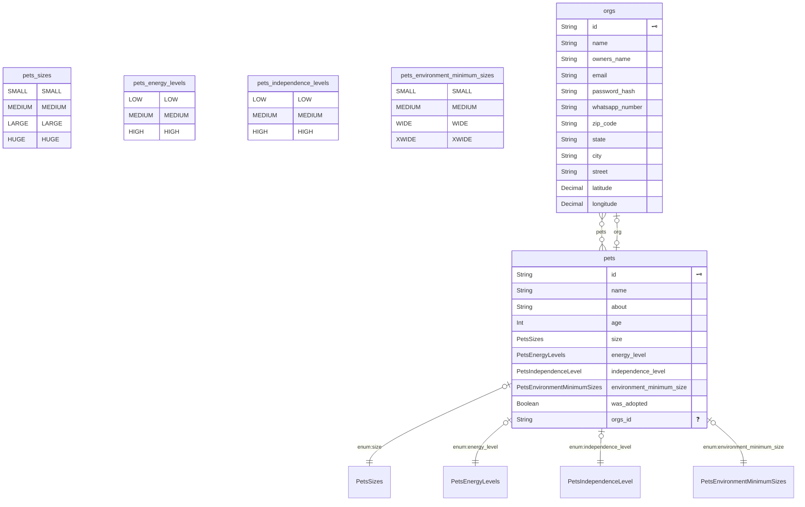

```mermaid
erDiagram

        pets_sizes {
            SMALL SMALL
MEDIUM MEDIUM
LARGE LARGE
HUGE HUGE
        }
    


        pets_energy_levels {
            LOW LOW
MEDIUM MEDIUM
HIGH HIGH
        }
    


        pets_independence_levels {
            LOW LOW
MEDIUM MEDIUM
HIGH HIGH
        }
    


        pets_environment_minimum_sizes {
            SMALL SMALL
MEDIUM MEDIUM
WIDE WIDE
XWIDE XWIDE
        }
    
  "orgs" {
    String id "🗝️"
    String name 
    String owners_name 
    String email 
    String password_hash 
    String whatsapp_number 
    String zip_code 
    String state 
    String city 
    String street 
    Decimal latitude 
    Decimal longitude 
    }
  

  "pets" {
    String id "🗝️"
    String name 
    String about 
    Int age 
    PetsSizes size 
    PetsEnergyLevels energy_level 
    PetsIndependenceLevel independence_level 
    PetsEnvironmentMinimumSizes environment_minimum_size 
    Boolean was_adopted 
    String orgs_id "❓"
    }
  
    "orgs" o{--}o "pets" : "pets"
    "pets" o|--|| "PetsSizes" : "enum:size"
    "pets" o|--|| "PetsEnergyLevels" : "enum:energy_level"
    "pets" o|--|| "PetsIndependenceLevel" : "enum:independence_level"
    "pets" o|--|| "PetsEnvironmentMinimumSizes" : "enum:environment_minimum_size"
    "pets" o|--|o "orgs" : "org"
```
